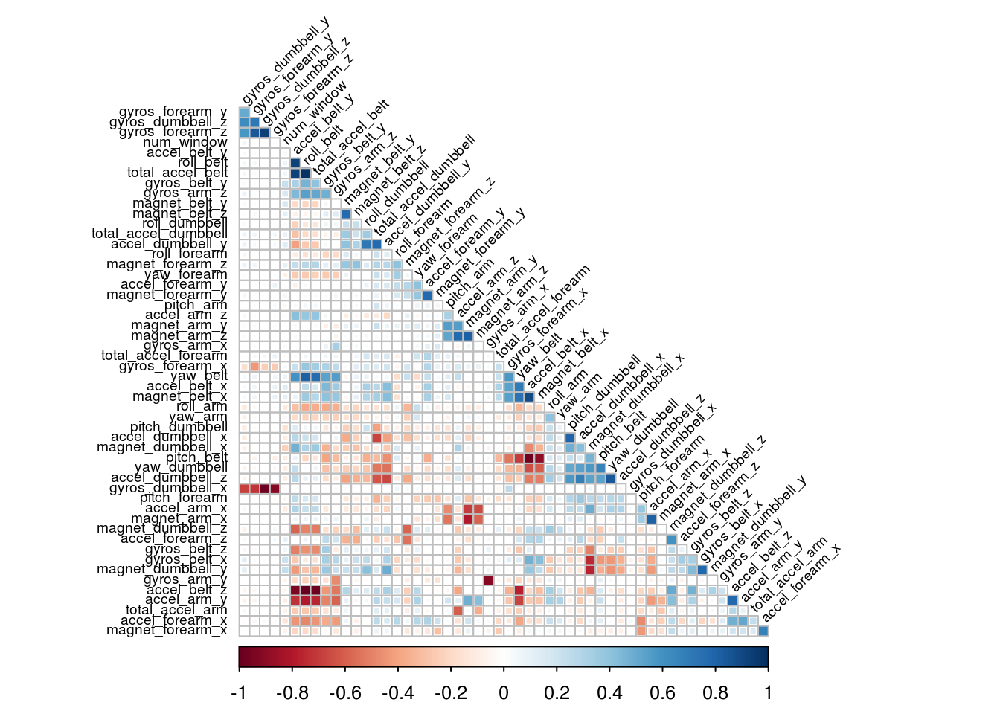
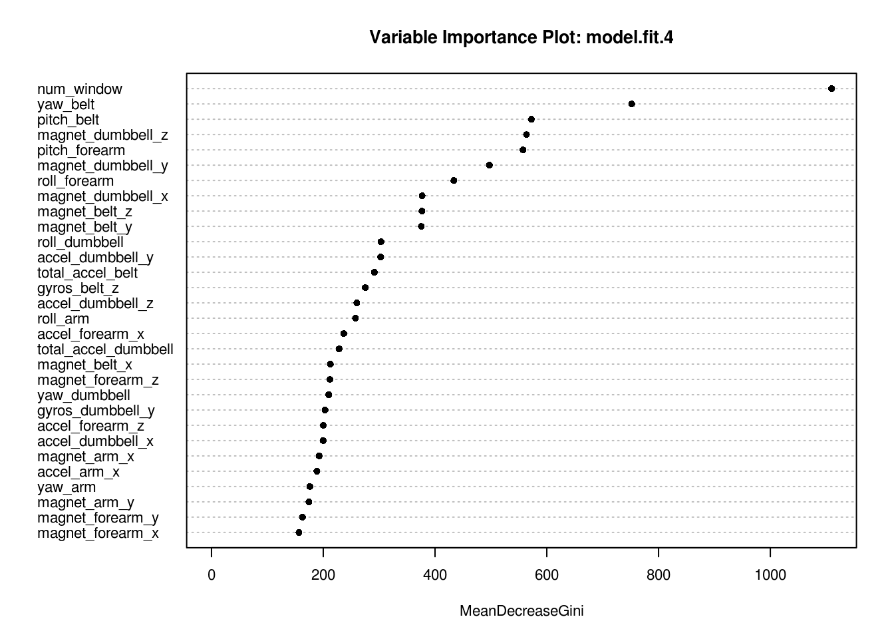
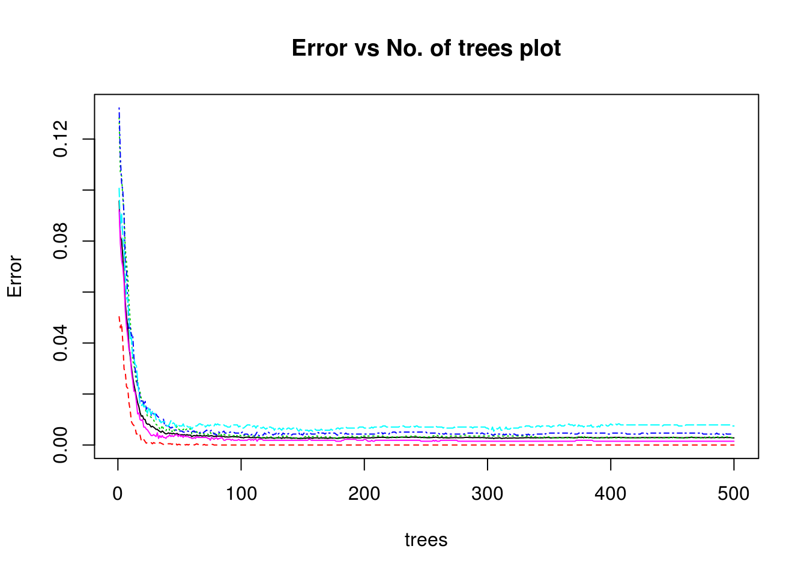

# Predicting Exercise Manner with Classification Methods

### Coursera: Practical Machine Learning - Final Project
#### Rajesh Thallam
#### 22-Jan-2017

## Background

Majority of the attention in human activity recognition research focuses on discrimination between different type of activities, but not quality of the activities. In this study, the goal is to investigate how well an activity was performed by six wearers of electronic devices. These six participants were between 20 to 28 years with little weight lifting experience. They were asked to perform one set of 10 repetitions of the Unilateral Dumbbell Biceps Curl in five different fashions, namely

- **Class A**: exactly according to the specification
- **Class B**: throwing the elbows to the front
- **Class C**: lifting the dumbbell only halfway
- **Class D**: lowering the dumbbell only half way
- **Class E**: throwing the hips to the front.

More information about the data and how quality of data was assured is available from the website [here](http://groupware.les.inf.puc-rio.br/har).

## Project Goal

The goal of this project is to predict the manner in which the participants did the exercise. In other words, we need to predict the different fashions of the Unilateral Dumbbell Biceps Curl performed by the participants. It is the `classe` variable in the dataset, and any of the other variables can be used to predict with.

### Data Preparation and Loading R packages  

#### Load packages

Based on the exploratory data analysis, it is clear that a non-linear model is right choice for making predictions. I chose to use regression trees and random forest to demonstrate the predictions. Below chunk loads the required packages


```r
## Load necessary packages
library(knitr)
library(rmarkdown)
library(caret)
library(randomForest)
library(rpart)
library(dplyr)
knitr::opts_chunk$set(cache=TRUE)
```

#### Getting Data

Below code chunk downloads the data files if they don’t exist in the `data` directory.


```r
# URL of the training and testing data
train.url ="https://d396qusza40orc.cloudfront.net/predmachlearn/pml-training.csv"
test.url = "https://d396qusza40orc.cloudfront.net/predmachlearn/pml-testing.csv"

# file names
train.name = "./data/pml-training.csv"
test.name = "./data/pml-testing.csv"

# if directory does not exist, create new
if (!file.exists("./data")) {
  dir.create("./data")
}

# if files does not exist, download the files
if (!file.exists(train.name)) {
  download.file(train.url, destfile=train.name, method="curl")
}

if (!file.exists(test.name)) {
  download.file(test.url, destfile=test.name, method="curl")
}
```

#### Read data into data frames


```r
# load the CSV files as data.frame 
train.raw = read.csv("./data/pml-training.csv", na.strings=c("NA", "#DIV/0!", ""), stringsAsFactors = FALSE)
test.raw  = read.csv("./data/pml-testing.csv" , na.strings=c("NA", "#DIV/0!", ""), stringsAsFactors = FALSE)
```

The training dataset contains 160 variables with 19622 observations and the test dataset contains 20 observations with 160 variables to test the performance of prediction of the classification model. Both training and test data sets have same variables except that the training data set has a predictor variable `classe` and test data has an additional field `problem_id` which is a running sequence.

## Data Cleaning

After observing the data and the distinct values for each column in the file, I planned to standardize the data values or types, remove irrelevant columns or columns with missing data that may not help the model.

#### Convert "#DIV/0" strings to NA


```r
index.divbyzero <- sapply(train.raw, function(x) x=="#DIV/0!")
train.raw[index.divbyzero] <- NA

index.divbyzero <- sapply(test.raw, function(x) x=="#DIV/0!")
test.raw[index.divbyzero] <- NA
```

#### Convert categorical variables to factors


```r
# converting predictor variable `classe` as a factor variable
train.raw$classe <- factor(train.raw$classe)
```

#### Removing insignificant columns

There are quite a few variables consisting only 0 or NA which will not help in making predictions and hence excluded them from the model. In addition, following variables were removed

- `X`: just a sequence from 1 to 19622
- `user_name`: names of the participants
- `timestamp` variables indicating the date/time of when the activity was performed
There is no seasonality pattern observed in `timestamp` variables and hence may not contribute to the classification.


```r
# set variable with variables to be removed
insignificant.columns <- c(
      "kurtosis_yaw_belt", "kurtosis_yaw_dumbbell", "kurtosis_yaw_forearm",
      "skewness_yaw_belt", "skewness_yaw_dumbbell", "skewness_yaw_forearm",
      "amplitude_yaw_belt", "amplitude_yaw_dumbbell", "amplitude_yaw_forearm",
      "X", "user_name", "raw_timestamp_part_1", "raw_timestamp_part_2",
      "cvtd_timestamp", "new_window")
```

#### Removing columns with missing data

There are still data columns with missing values (or NA). I excluded these variables as well from the data because these variables will not have enough power to explain their influence on the prediction. In addition, building a model based on variables that are mostly missing is impractical.


```r
# find variables with > 95% of values as missing or NA
max.NA.percent = 5
max.NA.count <- nrow(train.raw) / 100 * max.NA.percent
max.NA.columns <- names(which(colSums(is.na(train.raw) | train.raw == "") > max.NA.count))
```

#### Putting it all together

Create new training and test data sets after removing the previously identified variables from the data set.


```r
remove.train.columns <- names(train.raw) %in% c(insignificant.columns, max.NA.columns)
train.clean <- train.raw[!remove.train.columns]
remove.test.columns <- names(test.raw) %in% c(insignificant.columns, max.NA.columns, "problem_id")
test.clean <- test.raw[!remove.test.columns]
```

#### Excluding highly correlated variables

Having highly correlated variables in the training data set is just introducing redundancy and increasing computation time. I identified variables with high correlations amongst each other in the training data set. 


```r
library(corrplot)
classe.index <- which(names(train.clean) == "classe")
correlation.matrix <- cor(train.clean[, -classe.index])
highly.correlated <- findCorrelation(correlation.matrix, cutoff=0.9, exact=TRUE)
highly.correlated.columns <- names(train.clean[, highly.correlated])
corrplot(correlation.matrix, method="square", type="lower", order="hclust", tl.cex=0.60, tl.col="black", tl.srt = 45, diag = FALSE)
```

<!-- -->

There are some features that are quite correlated with each other. I excluded these highly correlated variables from the training and test data sets.


```r
remove.train.columns <- names(train.clean) %in% c(highly.correlated.columns)
train.clean <- train.clean[!remove.train.columns]
remove.test.columns <- names(test.clean) %in% c(highly.correlated.columns)
test.clean <- test.clean[!remove.test.columns]
```

After data cleansing, the training dataset now contains 47 variables with 19622 observations and the test dataset contains 20 observations with 46 variables to test the performance of prediction of the classification model.

## Data Partitioning

Since the test data does not have the predictor variable `classe`, performance of the classification model cannot be evalauted. Therefore, training data is split up with 75% as mini training data and the rest as validation data set.


```r
set.seed(118258)
partition <- createDataPartition(y=train.clean$classe, p = 0.75, list=FALSE)
training   <- train.clean[partition, ]
validation <- train.clean[-partition, ]
```

## Model Building

I started building a simple regression tree with and without pre-processing of source data. I used `trainControl` with method as `cv` (cross-validation) to generate parameters that further control how models are created.

### Regression Tree


```r
# setting option for 10-fold CV
train_control <- trainControl(method="cv", number=10)

# fit the model without pre-processing
model.fit.1 <- train(classe ~., method="rpart", data=training, trControl = train_control)
result.1 <- confusionMatrix(validation$classe, predict(model.fit.1, newdata = validation))
# confusion matrix
result.1$table
```

```
##           Reference
## Prediction    A    B    C    D    E
##          A 1131   38  226    0    0
##          B  137  344  467    0    1
##          C   12   37  805    0    1
##          D   69  148  520    0   67
##          E   72  200  353    0  276
```

```r
# statistics
result.1$overall
```

```
##       Accuracy          Kappa  AccuracyLower  AccuracyUpper   AccuracyNull 
##   5.212072e-01   3.940004e-01   5.071147e-01   5.352744e-01   4.834829e-01 
## AccuracyPValue  McnemarPValue 
##   6.808493e-08   0.000000e+00
```

```r
# fit the model with preprocessing 
model.fit.2 <- train(classe ~., method="rpart", preProcess=c("center", "scale"), data = training, trControl = train_control)
result.2 <- confusionMatrix(validation$classe, predict(model.fit.2, newdata = validation))
# confusion matrix
result.2$table
```

```
##           Reference
## Prediction    A    B    C    D    E
##          A 1131   38  226    0    0
##          B  137  344  467    0    1
##          C   12   37  805    0    1
##          D   69  148  520    0   67
##          E   72  200  353    0  276
```

```r
# statistics
result.2$overall
```

```
##       Accuracy          Kappa  AccuracyLower  AccuracyUpper   AccuracyNull 
##   5.212072e-01   3.940004e-01   5.071147e-01   5.352744e-01   4.834829e-01 
## AccuracyPValue  McnemarPValue 
##   6.808493e-08   0.000000e+00
```

The accuracies of the two models using regression tree isn’t good at all. The accuracy is only around 0.5212072, which is not acceptable. Since pre-processing the data didn’t help the performance of regression tree based predictions, I tried next with random forest.

### Random Forest

Random forest requires more computation time, so I chose to find variables that are more likely to predict `classe` well and see how the model performs first. The first random forest model evaluates if classification of data can be done using only highly correlated variables with predictor variable `classe`.


```r
# Get correlation matrix and find the variables with high correlation with classe
k <- training
k$classe <- as.numeric(training$classe)
cormatrix <- data.frame(cor(k[,-c(1)]))
cormatrix$name <- names(k[2:dim(training)[2]])
t <- data.frame(cbind(abs(cormatrix$classe), cormatrix$classe, cormatrix$name))
names(t) <- c("abs.cor", "cor", "name")

# show variables with highest correlation with classe
tail(arrange(t,abs.cor),8)
```

```
##              abs.cor                cor            name
## 39 0.184130936712403 -0.184130936712403   magnet_belt_z
## 40 0.189423746081111 -0.189423746081111 accel_forearm_x
## 41  0.24354988135274   0.24354988135274     accel_arm_x
## 42 0.254297690627065 -0.254297690627065    magnet_arm_y
## 43 0.291977056040928 -0.291977056040928   magnet_belt_y
## 44 0.296252257990573  0.296252257990573    magnet_arm_x
## 45 0.343809367231255  0.343809367231255   pitch_forearm
## 46                 1                  1          classe
```

```r
# try model with variable with highest corr with classe
model.fit.3 <- randomForest(classe ~ pitch_forearm + magnet_arm_x + magnet_belt_y + magnet_arm_y + accel_arm_x + accel_forearm_x + magnet_belt_z, data=training)
result.3 <- confusionMatrix(validation$classe, predict(model.fit.3, newdata = validation))
# confusion matrix
result.3$table
```

```
##           Reference
## Prediction    A    B    C    D    E
##          A 1224   77   49   35   10
##          B   35  783   85   21   25
##          C   19  107  677   43    9
##          D   41   21   47  675   20
##          E   18   30   29   16  808
```

```r
# statistics
result.3$overall
```

```
##       Accuracy          Kappa  AccuracyLower  AccuracyUpper   AccuracyNull 
##   8.497145e-01   8.101641e-01   8.394031e-01   8.596077e-01   2.726346e-01 
## AccuracyPValue  McnemarPValue 
##   0.000000e+00   1.515017e-06
```

If we predict the classe with the variables that correlates with classe the most (r> 0.1), we get a classification model with accuracy of 0.8497145 if we apply it on the testing set. This is fairly good since the prediction only depends on limited number of variables. It's evident random forest tree with just highly correlated variables performed much better than regression trees. Let's see if including all the variables in random variables does any better (runs longer)


```r
# try full model with all 
model.fit.4 <- randomForest(classe ~ ., data = training)
result.4 <- confusionMatrix(validation$classe, predict(model.fit.4, newdata = validation))
# confusion matrix
result.4$table
```

```
##           Reference
## Prediction    A    B    C    D    E
##          A 1394    0    0    0    1
##          B    1  946    2    0    0
##          C    0    3  852    0    0
##          D    0    0    3  800    1
##          E    0    0    0    0  901
```

```r
# statistics
result.4$overall
```

```
##       Accuracy          Kappa  AccuracyLower  AccuracyUpper   AccuracyNull 
##      0.9977569      0.9971628      0.9959901      0.9988798      0.2844617 
## AccuracyPValue  McnemarPValue 
##      0.0000000            NaN
```

The model considering all of the variables after dimension reduction/data cleaning earlier has a accuracy of 0.9977569, which gets even better. We can further inspect to see which variables or features were important in the random forest model.


```r
varImpPlot(model.fit.4, cex=0.7, pch=16, main = 'Variable Importance Plot: model.fit.4')
```

<!-- -->

The plot below shows how error rate varies for each class based on number of trees.


```r
plot(model.fit.4, , cex=0.7, main='Error vs No. of trees plot')
```

<!-- -->

## Out of sample error

Out of sample error is the error rate from new data (test). This is calculated by measuring the accuracy of the models predictions against data which was not used to build it. As illustrated the random forest model has an out of sample error rate of less than 1% which is considered to be very good.


```r
1-result.4$overall[1]
```

```
##    Accuracy 
## 0.002243067
```

## Conclusion

We can conclude that the random forest model with all variables included is a higly predictive model with an estimated out of sample error rate of 0.2243067%. Looking at the model results, we can evaluate that random forest classification technique works better than a regression tree in this case.

## Predicting on test data

Predicting `classe` for 20 test cases using the random forest model with all variables.


```r
results <- as.data.frame(predict(model.fit.4, newdata = test.clean), optional=TRUE)
```

`NOTE: results not shown intentionally`
